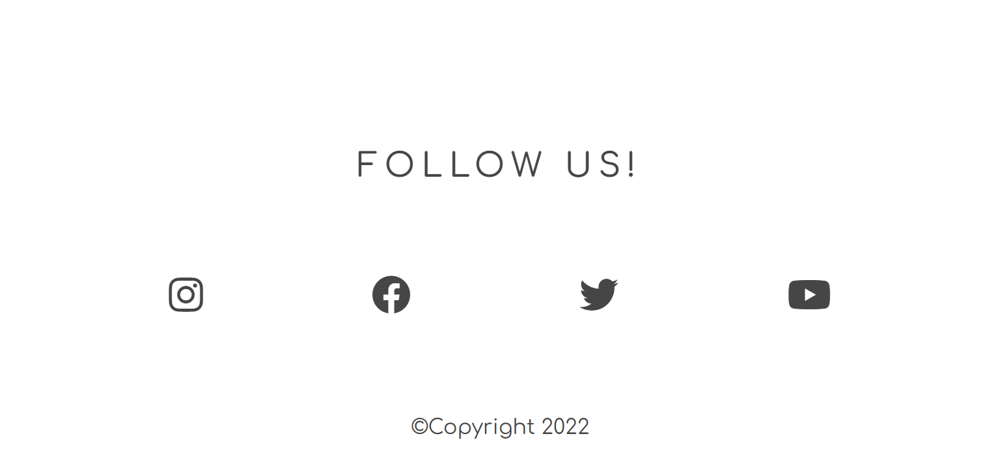

# Mind and body
## YOGA STUDIO

Mind and Body is a website that represents the physical yoga studio in Stockholm, Sweden. The website will target people who are looking to try yoga for the first time, begin their yoga practice or want to continue their yoga practice. Mind and Body has classes for all levels of Yoga, its for you who have no experience and also for you who have experience. This website is useful for Yogi (a person who enjoys yoga) to see when and what classes the studio is offering and it is where they will sign up and join Mind and Body.

# Features 

## Navbar
<ul><li>The navigation menu is on all four pages. The menu links to Home page, About, Classes, Contact and Logo</li>
<li>This makes it easy to find what you are looking for.</li>
</ul>

## The home page image
<ul><li>The image is a photo of a yoga mat. This lets the user know what the website is about</li>
<li>There is text that lets the user know that this is a Yoga studio</li>
<li>This section also has a "Book Now" button that sends the customers to the classes page where they can book a class.</li>
<li>There is a "Explore our classes" section allows the user to see what types of Yoga is being offered</li>
<li>This section also allows the user to use the "Learn More" button where they will be sent directly to the classes page, where they can book a class.</li>
<li>
The reviews are shown on the home page so the user can see if its a good enough studio for them.</li></ul>

## About us page
### About section
<ul><li>
This sections allows the user to read about the history of the yoga studio and what kind of studio Mind and Body is.</li>
<li>
This section in the about page introduces all the instructors, what kind of instructor they are and their contact information.</li>
<li>This is for every user wheter its their first time on the website, to see who the instructors are, and if a student needs to contact the instructors.</li></ul>

## Classes page
<ul
><li>The classes page have all the classes for the user too look through. When they have decided what class to take they can press the "book now" button and that sends them to the booking form</li>
<li>This allows the user to book a class at Mind and Body Yoga studio</li>
<li>The schedule also allows the user to see when the classes are instead of having to scroll up to the classes to make sure they have chosen the right one.</li>
</ul>

## Contact
<ul>
<li>The contact section allows the user to see the opening hours of the studio, contact information, and the location.</li>
<li>The contact form is for users to contact the studio with whatever questions they have.</li></ul>

## Contact response
<ul><li>
When a user has sent a question through the contact form they will be sent to contact-reply page.</li><li>
this text lets the user know when they can expect a response.</li><li>
The user can also press the "here" link and they will be sent to the home page.</li></ul>

### Footer
<ul><li>
The footer links to the studios social media.</li></ul>

## Future feature
<ul>
<li>Responsive design for accessibility on more devices
</li></ul>

## Testing
The website has been updated after these tests were made, and have not yet been tested.
### Code Validation
The Mind and Body Yoga studio html has been tested with<a href="https://validator.w3.org/"> W3C HTML Validator.</a> 

The Mind and Body Yoga studio has been tested with <a href="https://jigsaw.w3.org/css-validator/">W3C CSS Validator</a>

#### Lighthouse
The Mind and Body Yoga studio has been tested with <a href="https://chrome.google.com/webstore/detail/lighthouse/blipmdconlkpinefehnmjammfjpmpbjk?hl=sv">Lighthouse</a>

The website got tested for desktop.

The website got tested for mobile.

## Technologies Used
<ul>
<li>
HTML5 - For structure of the website
</li>
<li>
CSS3 - For styling of the website
</li>
<li>GitHub</li> - Used to host the website
<li>GitPod</li> - For deployment of the website
<li>Balsamiq</li> - For creating the Wireframes
</ul>

## Unfixed Bugs

## Deployment 
There has been bugs in the code, one of them being the images being the wrong size. I had to with help of an editing website been able to resize the images without having them look bad.

This website was deployed with GitHub Pages.
<ul>
<li>
First you click settings as shown on the image
</li>
<li>
Second you click pages as shown on the image
</li>
<li>
Third select the main branch or the master branch.
</li><li>
Now you wait a few minutes and the link for the website will show up as shown in the image</li>
</ul>

This is the live link to the website - <a href="https://frirsta.github.io/milestone-one/">https://frirsta.github.io/milestone-one/</a>

## Credits

### Content
<ul>
<li>
The Home page was taken from what I had learnt in the Love Running project.</li>
<li>The icons in the footer, the classes cards and contact information are fron <a href="https://fontawesome.com/">Font Awesome</a></li>
<li>Instructions on how to make a time table was taken from<a href="https://www.programming9.com/programs/html-codes/47-html-code-for-designing-of-time-table-using-table">Programming9</a></li>
</ul>

### Media

Hero image:
<a href="https://www.freepik.com/free-photo/hands-rolling-fitness-mat-concept-healthy-lifestyle_3955343.htm#query=yoga&position=4&from_view=search&track=robertav1">Image by yanalya</a> on Freepik

All review images have been taken from <a href="https://www.pexels.com/">Pexels</a>

About us image:
Image by Nick Wehrli: https://www.pexels.com/sv-se/foto/manniskor-kvinnor-rock-kondition-5345858/

Class images:
<a href="https://www.freepik.com/free-photo/group-sporty-people-child-pose_3954973.htm#query=yoga%20class&position=16&from_view=search&track=robertav1">Image by yanalya</a> on Freepik

<a href="https://www.freepik.com/free-photo/young-yogi-woman-group-people-paschimottanasana-pose_3954988.htm#query=yoga%20class&position=17&from_view=search&track=robertav1#position=17&query=yoga%20class">Image by yanalya</a> on Freepik

<a href="https://www.freepik.com/free-photo/group-sporty-people-bird-dog-exercise-with-instructor_3954984.htm#from_view=detail_alsolike">Image by yanalya</a> on Freepik

<a href="https://www.freepik.com/free-photo/group-sporty-people-sukhasana-pose_3955007.htm#from_view=detail_alsolike">Image by yanalya</a> on Freepik

<a href="https://www.freepik.com/free-photo/group-sporty-people-donkey-pose_3954980.htm#from_view=detail_alsolike">Image by yanalya</a> on Freepik

<a href="https://www.freepik.com/free-photo/group-young-sporty-people-sitting-sukhasana-exercise_3955016.htm?query=yoga%20class#from_view=detail_alsolike">Image by yanalya</a> on Freepik

<a href="https://www.freepik.com/free-photo/group-young-sporty-people-sitting-sukhasana-exercise_3954523.htm?query=yoga%20class#from_view=detail_alsolike">Image by yanalya</a> on Freepik

<a href="https://www.freepik.com/free-photo/group-young-sporty-people-sitting-easy-seat-pose_3954522.htm?query=yoga%20class#from_view=detail_alsolike">Image by yanalya</a> on Freepik

<a href="https://www.freepik.com/free-photo/group-young-sporty-people-meditating-easy-seat-pose_3954518.htm?query=yoga%20class#from_view=detail_alsolike">Image by yanalya</a> on Freepik

<a href="https://www.freepik.com/free-photo/funny-young-woman-laughing-multi-ethnic-group-fitness-yoga-cl_3954981.htm?query=yoga%20class#from_view=detail_alsolike">Image by yanalya</a> on Freepik

Instructor images:
<a href="https://www.freepik.com/free-photo/beautiful-girl-is-engaged-yoga-studio_6632280.htm#query=yoga&position=0&from_view=search&track=robertav1">Image by prostooleh</a> on Freepik
<a href="https://www.freepik.com/free-photo/beautiful-girl-is-engaged-yoga-studio_6632280.htm#query=yoga&position=0&from_view=search&track=robertav1">Image by prostooleh</a> on Freepik
<a href="https://www.freepik.com/free-photo/beautiful-girl-is-engaged-yoga-studio_6632280.htm#query=yoga&position=0&from_view=search&track=robertav1">Image by prostooleh</a> on Freepik
Image by <a href="https://www.freepik.com/free-photo/young-woman-practicing-meditation_20282967.htm#query=yoga&position=23&from_view=search&track=robertav1">Freepik</a>

#### Other
The commits at the start of the project till about a week ago have not been done properly because my plan was to have this code as a draft.